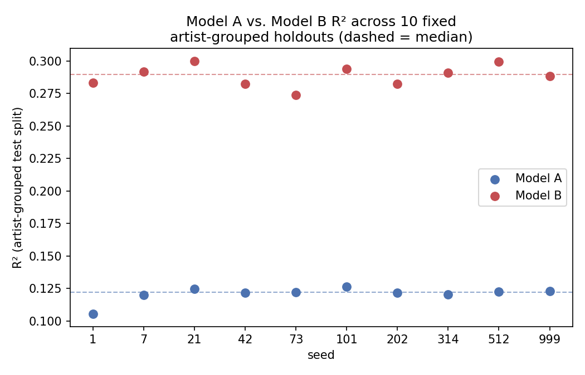
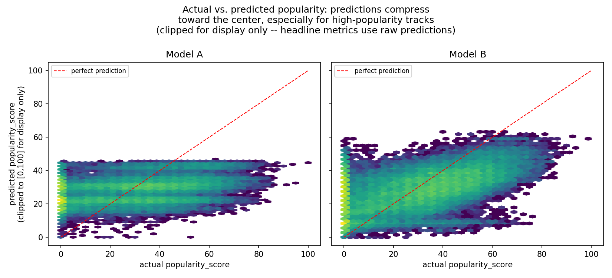

# Spotify Content Performance Analytics

A reproducible, professional-tooling analytics project on a 278K-row Spotify
track-catalog extract: data-quality engineering, a documented SQL metric
layer, and interpretable statistical modeling of content, artist, genre,
and release-period characteristics against track popularity.

**Status: Phase 2 (data foundation + SQL analytics layer) and Phase 3
(interpretable popularity modeling) complete.** No clustering, dashboards,
or deployment have been built — see [Phase 3: Popularity Modeling](#phase-3-popularity-modeling)
and its Scope Limit note.

## At a Glance

| | |
|---|---|
| **Dataset** | 277,938 raw tracks × 34 columns (Spotify catalog extract, coursework-supplied) |
| **Analytical questions** | *(SQL)* How do content/artist/genre/release characteristics differ across popularity levels? *(modeling)* How much of that variation do observable features explain, and does artist popularity add more? |
| **Stack** | Python, pandas, DuckDB + SQL, scikit-learn, statsmodels, pytest, Jupyter |
| **Strongest findings** | Genre coverage rises from 32.8%→71.75% low→high popularity tier (Phase 2); a linear model on content features alone reaches median R²≈0.122 (range 0.106–0.127 across 10 fixed artist-grouped holdouts) but strongly compresses predictions toward the middle of the range, badly underpredicting genuinely popular tracks (Phase 3); adding artist popularity raises median R² to ≈0.290 (range 0.274–0.300), consistently across every holdout |
| **Where things are** | SQL: [`sql/`](sql/) · Notebooks: [`notebooks/`](notebooks/) · Figures: [`figures/`](figures/) · Full write-ups: [`reports/`](reports/) |

*(Full measurement caveats, no-causal-claims stance, and methodology detail follow below — this table is a map, not a substitute for them.)*

## Headline Results

- Genre metadata coverage rises from 32.81% in the low-popularity tier to
  71.75% in the high-popularity tier, so genre-based comparisons are subject
  to strong selection in metadata availability.
- Across 10 fixed artist-grouped holdouts, the content/context model has
  median test R² = 0.122, while the specification adding artist popularity
  has median test R² = 0.290.
- Both models compress predictions toward the middle of the observed 0–100
  popularity range; the content/context model especially struggles with the
  highest-popularity tracks.

<p>
  
  
</p>

**Left:** Model A (content/context only) vs. Model B (+ artist popularity)
test R² across 10 fixed artist-grouped holdouts — Model B's advantage holds
on every single seed, not just a convenient one. **Right:** actual vs.
predicted popularity for both models on one fixed representative holdout
(seed 42) — predictions cluster well below the diagonal at the
high-popularity end, illustrating the compression described above. Neither
chart implies a causal relationship between any feature and popularity.

## What This Analysis Supports — and What I Would Test Next

- Genre comparisons should account for substantial and non-random metadata
  availability.
- Artist-popularity context materially improves predictive performance, but
  `artist_1_pop` is conceptually close to the target and is
  predictive/contextual, not causal.
- Observable content/context features in this dataset do not identify the
  extreme upper tail of popularity well under this linear specification.
- A real content/growth decision would require longitudinal outcome data
  and exposure/marketing variables to distinguish prediction from
  incremental effect.

## Why This Project Exists

This project extends an earlier CS251 coursework exploratory analysis
(`../cs251-data-analysis-projects/project02`, preserved unchanged) into a
separate, independent professional analytics project built with
industry-standard tooling.

- The original coursework implemented a custom NumPy-based `Data`/`Analysis`
  class hierarchy from scratch and used it to perform categorical-variable
  exploratory data analysis (counting, filtering, bar charts) on the same
  Spotify extract, as a class assignment on building data-structure and
  EDA fundamentals.
- This repository does not reuse that class hierarchy. It is a fresh
  pipeline built with pandas, DuckDB, and pytest, organized as a
  reproducible loader → cleaning → SQL-analytics workflow with real tests
  and documented metric definitions.
- The original CS251 repository is untouched by this work: no files there
  were modified, and its `git status` was verified clean both before and
  after this project was built.

## Business / Analytical Question

> How do content, artist, genre, and release characteristics differ across
> higher- and lower-popularity tracks in this dataset, and how do those
> relationships vary across segments and release periods?

This is observational catalog data. **This project does not make causal
claims.** An observed association between a track/artist/genre/release
characteristic and `popularity_score` is never described as that
characteristic *causing* popularity, and this is not framed as paid-media,
user-acquisition, or growth-marketing analytics — it is descriptive analysis
of a fixed data extract.

## Dataset

| | |
|---|---|
| Shape (raw) | 277,938 rows × 34 columns |
| Shape (primary analytical dataset) | 277,937 rows (1 exact duplicate removed) |
| Shape (sensitivity dataset) | 277,846 rows (one row per `(track, artist_1)`) |
| Source file | `data/raw/spotify.csv` (gitignored, 47 MB) |
| SHA-256 | `4045adda473d6cd4fde6f3a11253faf37d7ee26fd122bcfd5c8a6c1fc5441974` |

**Key variables:** `track`, `artist_1`, `artist_1_pop`, `artist_1_genre_1..3`,
`release_date`, `popularity_score` (0–100, Spotify's algorithmic popularity
score), `popularity` (course-provided 3-level banding of `popularity_score`
— see below), `album_type`, `tempo`, `duration_ms`, and course-provided
3-level bins of several Spotify audio features (`danceability`, `energy`,
`speechiness`, `acousticness`, `instrumentalness`, `liveness`).

**Provenance status:** the CS251 course materials describe this dataset as
*"collected from the Spotify music service ... obtained using its web API."*
That is the course's own description provided alongside the file — it has
not been independently verified by this project (no API request log or
collection script accompanies the extract). See `data/README.md` for the
full provenance statement and known sampling limitations.

**Unknown sampling frame:** there is no evidence this ~278K-row extract is a
random or representative sample of Spotify's catalog. Every
percentage/share figure in this project is scoped to "tracks in this
dataset," never generalized to "Spotify tracks" broadly.

**Unknown collection time:** `popularity_score` is a snapshot at whatever
moment Spotify was queried to assemble this extract. That moment is not
recorded in the data and is **not** inferred from filesystem timestamps
(those reflect when the course copy was written to disk, not when Spotify
was queried).

**Important missingness:** `artist_2` and `artist_3` (artist *name* fields)
are **100% missing** in this extract; `artist_1_genre_1` is missing for
60.3% of tracks, and genre missingness is not random with respect to
popularity or release period (see Measurement Caveats below).

**`popularity_score` interpretation:** an integer 0–100 Spotify popularity
score. The course-provided categorical `popularity` column (`0low` /
`1moderate` / `2high`) was found to be an exact banding of it —
`0low = 0–33`, `1moderate = 34–66`, `2high = 67–100` — recovered empirically
by cross-tabulation, not assumed (see `reports/data_quality_report.md` §16).

## Measurement Caveats

These constraints propagate through every analysis, notebook, SQL query, and
metric definition in this project:

- **Snapshot nature of popularity.** `popularity_score` reflects play volume
  and recency of plays *as of the dataset's unknown collection time*. It is
  never described as a track's "current" popularity in the reader's present,
  nor as a stable, time-invariant property of the track.
- **Release-period recency/survivorship.** `release_year` / `release_date`
  are entangled with recency and survivorship: an old track still present in
  this dataset, with whatever popularity score it has, is not a random
  sample of everything released in that decade — it's whatever subset
  survived catalog curation and is still being played enough to register a
  score. Decade comparisons are phrased as "current popularity of tracks
  released in each decade" or "popularity at the dataset's collection time,"
  never as "performance by decade."
- **Sampling-frame limitation.** See Dataset section above — no share or
  percentage is generalized beyond "tracks in this dataset."
- **`artist_1_pop` / track popularity entanglement.** `artist_1_pop` is
  itself a Spotify-computed popularity signal for the primary artist, and it
  is not independent of the track's own `popularity_score` — popular artists
  mechanically tend to have popular tracks via correlated underlying
  algorithmic signals. `artist_1_pop` is used descriptively throughout this
  project and never treated as an independent causal predictor of track
  popularity.
- **Genre-availability selection issue.** Tracks with an observed
  `artist_1_genre_1` differ systematically from tracks without one: higher
  median/mean `popularity_score`, higher mean `artist_1_pop`, and a
  different release-decade mix (see
  `reports/data_quality_report.md` §15 for exact figures). Every
  genre-conditioned claim in this project is phrased as "among tracks in
  this dataset with an observed primary genre," never as an unconditional
  statement about all tracks.

## Analytical Workflow

```
data/raw/spotify.csv (gitignored)
        │  src/load_data.py   -- SHA-256 validation, schema validation, missing-value standardization
        ▼
   raw DataFrame (277,938 rows × 34 cols)
        │  src/clean_data.py  -- exact-dedup, derived fields, quality flags
        ▼
   primary analytical dataset (277,937 rows) ──┐
        │  build_sensitivity_dataset()          │
        ▼                                       │
   sensitivity dataset (277,846 rows)            │
        │                                        │
        └──────────────┬─────────────────────────┘
                        ▼
              src/build_database.py
                        │  writes Parquet (data/processed/, gitignored)
                        │  builds DuckDB database (data/processed/spotify.duckdb, gitignored)
                        ▼
              sql/01_data_quality.sql, 02_kpi_summary.sql, 03_segment_analysis.sql
                        ▼
              notebooks/01_data_quality_and_cleaning.ipynb
              notebooks/02_sql_business_analysis.ipynb
```

## Data Quality Findings

Full findings, with every number recomputed programmatically (never
hard-coded), are in [`reports/data_quality_report.md`](reports/data_quality_report.md).
Highlights:

- 1 exact full-row duplicate pair; 91 `(track, artist_1)` repeat groups
  (182 rows), retained by policy rather than deduplicated on popularity.
- `artist_2` / `artist_3` are 100% missing as name fields — yet
  `artist_2_pop` / `artist_3_pop` are populated for 12.5% / 3.4% of rows
  respectively, describing artists this extract cannot identify by name.
- 90 rows with `tempo == 0`; 13 rows with `release_date == 1899`; both
  flagged, neither assumed invalid, neither deleted.
- 16.86% of tracks have `popularity_score == 0`, and the bottom 10% of the
  distribution is entirely 0 — a pattern *consistent with* upstream
  pre-filtering, reported as suggestive evidence, not proof.
- Genre availability is associated with higher popularity, higher artist
  popularity, and a different release-decade mix (see Measurement Caveats).
- Primary-vs-sensitivity-dataset KPI deltas are trivial for every metric
  except `repeat_track_artist_share`, which is exactly 0% in the sensitivity
  dataset by construction (one row per `(track, artist_1)`), not a
  substantive finding.
- Genre coverage rises sharply and monotonically with popularity tier
  (32.8% low → 47.7% moderate → 71.75% high) — the strongest single
  confirmation of the genre-availability selection issue (see SQL Analysis).

## SQL Analysis

The SQL layer runs against a local DuckDB database built from the primary
analytical dataset (`src/build_database.py`; the `.duckdb` file itself is
gitignored and rebuilt on demand). All 19 statements across the three files
below run cleanly against that database.

- **`sql/01_data_quality.sql`**: reproduces the core data-quality audit in
  SQL as an independent check against the pandas computations above — row
  counts, missingness, exact/repeat duplicate counts, genre coverage,
  quality-flag counts, popularity distribution (via `PERCENTILE_CONT`), and
  release-decade coverage.
- **`sql/02_kpi_summary.sql`** (5 queries, Q1–Q5): current popularity by
  release decade; popularity distribution and high-popularity share by
  genre (conditioned on observed genre); genre coverage by decade
  (`HAVING` on small-decade groups); popularity metrics by album type.
- **`sql/03_segment_analysis.sql`** (Q6–Q10): primary-genre ranking within
  release decades (`RANK() OVER (PARTITION BY ...)`, chosen over
  `ROW_NUMBER()` so tied genres share a rank); genre share within decade
  (a window *aggregate*, `SUM() OVER (PARTITION BY ...)` with no `ORDER BY`
  inside the window, so it returns each decade's full total rather than a
  running sum); genre availability and top genres ranked by popularity tier;
  a primary-vs-sensitivity KPI comparison computed directly in SQL (matches
  the pandas figures above to 3+ decimal places); and a descriptive
  release-period profile by album type, checking (not confirming) the
  popularity-gap hypothesis raised in Q5.

All 10 queries (Q1–Q10) were reviewed for grain, null handling, aggregation
semantics, and window-function behavior before being treated as final. Each
query's file comment documents that review, including the reasoning behind
specific design choices — for example, why `RANK()` was used over
`ROW_NUMBER()` for tie handling (Q6), so genres tied on the same count share
a rank rather than being arbitrarily ordered, and why the window in Q7
deliberately omits `ORDER BY` (adding one would change the frame from a
full-partition total to a running sum, breaking the percentage calculation).
Full results and narration are in `notebooks/02_sql_business_analysis.ipynb`.

## Phase 3: Popularity Modeling

**Question:** how much variation in `popularity_score` is associated with
observable track/content/context characteristics, and how much additional
predictive power appears when `artist_1_pop` is included? **This is
observational data — nothing below is a causal claim**, and the goal is a
defensible analytical comparison, not maximum R².

Full analysis, all diagnostics, and 4 figures are in
[`notebooks/03_popularity_modeling.ipynb`](notebooks/03_popularity_modeling.ipynb)
and [`figures/`](figures/); a non-technical summary is in
[`reports/executive_summary.md`](reports/executive_summary.md). This section
gives the headline specification and results.

### Model specifications

- **Target:** `popularity_score`. `popularity`, `popularity_tier`, and
  `is_high_popularity` are excluded from every model — all are derived
  directly (`popularity` *exactly*, per §16 above) from the target.
- **Model A (content/context):** `loudness`, `valence`, `tempo` (90
  zero-tempo rows treated as missing, median-imputed on training data only),
  `track_duration_minutes`, `album_type`, `artist_1_genre_1` (all 17
  observed genres as individual levels, plus an explicit `Unknown` level —
  never collapsed to top-N/Other or merged into another category), and
  `release_decade_clean` as a **categorical** feature — entangled with
  recency, survivorship, and catalog composition, not a pure content
  attribute (same caveat as the Phase 2 SQL analysis). This `Unknown`
  recoding is specific to the modeling layer, needed because a one-hot
  encoder requires an explicit category to represent missingness — it is
  **not** how the SQL layer treats missing genre. `sql/*.sql` always
  preserves it as a true SQL `NULL`, filtered explicitly with
  `IS NOT NULL`/`IS NULL` per query rather than recoded to any label (see
  SQL Analysis above).
- **Model B = Model A + `artist_1_pop`.** `artist_1_pop` is conceptually
  very close to the outcome (see Measurement Caveats above) — Model B is a
  contextual/predictive comparison, never evidence of a causal
  artist-popularity effect.
- **Pipeline:** ordinary linear regression inside an sklearn
  `ColumnTransformer` + `Pipeline`. Continuous features are median-imputed
  and standard-scaled on training data only. Categorical features are
  one-hot encoded with `categories="auto"` — the encoder's vocabulary
  (which category names exist at all) is learned **strictly from the
  training split**, never from the full dataset or the held-out test rows.
  The dropped reference category per feature (`album_type`→`album`,
  genre→`Unknown`, decade→`2010`) is fixed a priori from the overall
  dataset's composition — a constant of the analysis design, not
  re-derived per split — and `handle_unknown="ignore"` safely encodes any
  category unique to a given test split as all-zeros.
- **Baseline:** predicts the training-set mean for every test row.

### Split design

**Primary generalization evidence: a repeated artist-grouped split**
(`GroupShuffleSplit`, 10 fixed, pre-declared seeds —
`[1, 7, 21, 42, 73, 101, 202, 314, 512, 999]`, chosen before looking at any
result and never adjusted afterward). Recognized named-artist groups are
held out across train/test; unidentified or placeholder credits are
assigned individual synthetic groups, so underlying performer overlap
cannot be ruled out for those rows (see "Grouping key" below). **Secondary:
a conventional reproducible random row split** (seed 42), answering a
different practical question, not a "less correct" one (see below).

**Grouping key.** `artist_1` is a useful approximate artist identifier, but
this dataset contains labels that do not name one canonical artist:
`"Various Artists"` (14,840 rows, a standard compilation-album credit
covering many unrelated performers), `"Original Cast"` (8 rows, a
cast-recording credit), and `"Unknown"` / `"Unknown Artist"` (4 / 3 rows,
explicit unidentified-artist placeholders). These were found by an exact,
anchored text-pattern search (e.g. `"^various artists?$"`,
`"^unknown( artist)?$"`), never inferred from frequency alone — many
genuine artists are also high-frequency (e.g. "Taylor Swift" at 241 rows).
Each occurrence of one of these labels, like each row with a missing
`artist_1`, gets its **own unique synthetic group** rather than being
treated as one shared artist. After this correction: 105,152 groups total,
median size 1, 90th/99th percentile sizes 5/28, and the single largest
group is **0.10% of the dataset** (the ten largest real-artist groups range
185–267 tracks) — no remaining group is large enough to dominate a
held-out fold the way an unsplit "Various Artists" group once could.

### Repeated grouped-split results (primary generalization evidence)

| | R² range (10 seeds) | median R² | median MAE | median RMSE |
|---|---|---:|---:|---:|
| Model A | 0.106 – 0.127 | **0.122** | 16.51 | 19.57 |
| Model B | 0.274 – 0.300 | **0.290** | 14.27 | 17.65 |

Model A is consistently modest and stable across all 10 repeated/fixed
artist-grouped holdouts. **Model B consistently outperforms Model A on
every single seed.** Performance varies modestly across the 10 holdouts.
Test-set size, group count, and mean popularity are relatively stable
(55,587 ± ~1,100 rows; 21,031 held-out groups on every seed; test-mean
popularity 27.72–28.23), but this analysis does not isolate the source of
the remaining score variation — the model specification and preprocessing
are identical across all 10 runs, but distinguishing test-fold composition
effects from any other source of run-to-run difference was not attempted
here.

### Random split — a different use case, not a different verdict

- **Random row split** approximately asks: *how well can the model predict
  another track when artists represented in the test set may already have
  other tracks represented in training?* Relevant to a platform analyzing
  an existing catalog where known artists already have historical data.
- **Artist-grouped split** approximately asks: *how well can the model
  predict tracks credited to a different recognized named-artist group than
  any in training?* This is not a clean test of generalization to
  brand-new artists with no established popularity history: recognized
  named-artist groups are held out across train/test, but unidentified or
  placeholder credits (see "Grouping key" above) are each assigned their
  own synthetic group, so underlying performer overlap cannot be ruled out
  for those rows specifically.

Neither is universally superior. In this dataset, with the corrected
grouping key, the two designs largely **agree**:

| | grouped (median of 10 seeds) | random (seed 42) |
|---|---:|---:|
| Model A R² | 0.122 | 0.115 |
| Model B R² | 0.290 | 0.276 |

The random split does, in principle, allow information associated with the
same artist identity to appear across train and test, while the grouped
split holds out recognized named-artist groups — that structural
difference is real. But it does not produce a large gap here: we do not
have direct evidence in this dataset of information flowing
inappropriately from training into test under the random design. An
earlier working hypothesis that the random split was "inflating" Model B's
apparent value was investigated directly and traced instead to a since-
corrected grouping-key defect (see `"Various Artists"` below), not to the
random split itself.

### `"Various Artists"`: inspection and residual impact

`artist_1_pop` is **exactly constant (0.0) across all 14,840
`"Various Artists"` rows**, while their actual `popularity_score` varies
substantially (mean ≈16, std ≈19, up to 81) — confirmed directly, not
inferred: this field does not represent the actual underlying performers
for these compilation tracks. Before the grouping-key fix, this one label
could land entirely on one side of a single split and dominate the
headline comparison; excluding it from evaluation (diagnostic only — these
rows are not removed from training or the dataset) now changes each
model's seed-42 R² by only a few hundredths, confirming the fix resolved
the dominant source of the earlier instability.

### Target-range compression (a central finding, not a footnote)

Actual `popularity_score` has a standard deviation of ≈21 and reaches 100.
Model A's predictions have a standard deviation of only ≈7 and never
exceed the high-40s across any of the 10 seeds; Model B's predictions have
a standard deviation of ≈11 and never exceed the low-60s. For genuinely
high-popularity tracks (actual tier mean ≈72), Model A's mean prediction is
only ≈34 (MAE ≈38) and Model B's is ≈44 (MAE ≈28) — better, but still a
severe underprediction. **Phrased carefully and scoped to this analysis:**
observable track/content/context features, in this linear specification,
on this dataset, distinguish low- and middle-of-the-catalog popularity to a
modest degree but do not identify extreme popularity well. This is not
generalized to a claim that content characteristics cannot matter for
popularity, and no nonlinear model was added to try to close this gap
(out of scope for this phase).

### Bounded-prediction diagnostic

`popularity_score` is bounded [0, 100]; predictions were never silently
clipped for headline metrics. Across all 10 grouped seeds: Model A
predictions fall below 0 for 0.011%–0.061% of test rows; Model B for
0.039%–0.145%. **Neither model ever predicts above 100, on any seed.**

### Other findings

- Residual analysis (illustrative seed-42 split): `compilation` tracks show
  a modestly higher MAE than `album`/`single`, but the large bias seen
  under the uncorrected grouping key is gone — most of it traced to the
  `"Various Artists"` artifact above, not a persistent modeling weakness.
- Performance by artist-frequency group (descriptive only — **not** a test
  of how Spotify computed `artist_1_pop`; missing/placeholder `artist_1`
  rows excluded, using the same recognized-artist definition as the split's
  grouping key — including them made `"Various Artists"` alone dominate the
  "100+ tracks" bucket): Model B outperforms Model A on both R² and MAE in
  every bucket, including "100+ tracks per artist" (R² ≈0.18 vs. ≈0.16,
  MAE ≈15.3 vs. ≈16.4 for Model A).
- Standardized coefficients (Model B, illustrative split): `artist_1_pop`
  dominates (+9.8/SD — itself a marker of target proximity, not a robust,
  generalizable signal), `loudness` (+0.63/SD) and `valence` (+0.27/SD)
  positive, `track_duration_minutes` (-0.73/SD) and `tempo` (-0.22/SD)
  negative. Categorical effects (genre/decade/album-type) are reported
  separately, never combined into the same ranking as standardized
  continuous coefficients.
- A reduced `statsmodels` OLS specification (standardized Model-A
  continuous features + `album_type` only, fit on the grouped training
  split) is reported for descriptive coefficient directions only, not as an
  inferential confirmation. Its coefficient signs mostly match the Model B
  coefficients above (`loudness`, `track_duration_minutes`, `tempo`,
  `album_type` all point the same direction); `valence`'s estimate is
  near-zero and its sign is not stable once genre and decade are omitted
  from the specification. This reduced spec's default standard errors
  assume independent, identically distributed errors under a nonrobust
  covariance estimate — they do not account for repeated observations
  sharing the same artist, or for the genre/decade structure this reduced
  spec drops, so no significance-based claim is made from it. It also
  changes more than one feature set at once relative to Model B (genre and
  decade together), so a coefficient difference between the two cannot be
  attributed to either omitted variable individually. Associational only,
  no causal interpretation.
- **Sensitivity dataset:** one grouped evaluation (seed 42) on the
  one-record-per-`(track, artist_1)` dataset — Model B remains clearly
  better than Model A in this additional holdout too. Note this comparison
  does not cleanly isolate the effect of deduplication alone: rebuilding
  the sensitivity dataset removes rows and shifts every remaining row's
  position, which changes the synthetic group IDs assigned to
  missing/placeholder `artist_1` rows (§4) and therefore the exact split
  composition at "seed 42" — the observed deltas reflect both the dataset
  change and this split-composition effect together, not deduplication in
  isolation.

### Scope limit

No clustering (K-means, PCA), no KNN, no tree ensembles/boosting, no neural
networks, no dashboards (Streamlit/Tableau/Power BI), no APIs, and no
deployment were added in this phase.

## Repository Structure

```
spotify-content-performance-analytics/
    README.md
    .gitignore
    requirements.txt
    data/
        README.md              -- provenance, hashes, sampling limitations
        raw/                    -- gitignored raw CSV
        processed/              -- gitignored Parquet + DuckDB build artifacts
    sql/
        01_data_quality.sql     -- complete
        02_kpi_summary.sql      -- complete (Q1-Q5, built interactively)
        03_segment_analysis.sql -- complete (Q6-Q10, see SQL Analysis)
    src/
        load_data.py            -- raw CSV loader, hash + schema validation
        clean_data.py           -- cleaning policy, derived fields, sensitivity dataset
        build_database.py       -- Parquet + DuckDB build
        metrics.py               -- documented KPI/metric layer
        quality_audit.py         -- reusable data-quality audit computations
        modeling.py              -- Phase 3: modeling frame, pipeline, splits, diagnostics
    notebooks/
        01_data_quality_and_cleaning.ipynb
        02_sql_business_analysis.ipynb
        03_popularity_modeling.ipynb
    figures/
        01_model_comparison_grouped_split.png
        02_actual_vs_predicted.png
        03_standardized_coefficients.png
        04_grouped_vs_random_split.png
    reports/
        data_quality_report.md
        executive_summary.md
    tests/
        test_load_data.py
        test_clean_data.py
        test_metrics.py
        test_database.py
        test_modeling.py
```

## Reproducibility

**Requires access to the original coursework-supplied `spotify.csv`, which
is not included in or downloadable from this repository** — see
`data/README.md` "Getting the raw data" for what that file is and how its
identity is verified. Without it, steps 2–3 and 5 below cannot run; the
code, SQL, tests against synthetic data, and already-committed notebook
outputs/figures remain readable regardless.

```bash
python3 -m venv .venv && source .venv/bin/activate
pip install -r requirements.txt

# 1. Copy the raw CSV into place (not committed to this repo):
cp /path/to/spotify.csv data/raw/spotify.csv

# 2. Build the processed datasets, Parquet files, and DuckDB database:
python -m src.build_database

# 3. Run the SQL layer (uses the `duckdb` Python package already in
#    requirements.txt -- no separate DuckDB CLI install required; a
#    standalone `duckdb` executable would also work if you have one, via
#    `duckdb data/processed/spotify.duckdb < sql/01_data_quality.sql`):
python3 - <<'PY'
import duckdb
for f in ["sql/01_data_quality.sql", "sql/02_kpi_summary.sql", "sql/03_segment_analysis.sql"]:
    con = duckdb.connect("data/processed/spotify.duckdb")
    sql = "\n".join(l for l in open(f) if not l.strip().startswith("--"))
    for stmt in [s.strip() for s in sql.split(";") if s.strip()]:
        print(con.execute(stmt).fetchdf())
    con.close()
PY

# 4. Run the test suite:
pytest

# 5. Execute the notebooks headlessly:
jupyter nbconvert --to notebook --execute --inplace \
    notebooks/01_data_quality_and_cleaning.ipynb \
    notebooks/02_sql_business_analysis.ipynb \
    notebooks/03_popularity_modeling.ipynb
```

## Limitations

- This is a single, fixed extract of unknown sampling frame and unknown
  collection date — every finding is scoped to "this dataset," not to
  Spotify's catalog or to any real-world business outcome.
- `artist_2` / `artist_3` are unusable as artist-name fields; any
  collaboration-related analysis in this project is scoped to `artist_1`
  only.
- Genre coverage is 39.7% and is not missing at random — genre-conditioned
  findings describe the genre-labeled subset, not the full dataset.
- No causal claims are made anywhere in this project. Associations between
  content/genre/release characteristics and `popularity_score` are
  descriptive only. Where a plausible explanation is raised (e.g.
  release-period age for compilations' lower popularity,
  `sql/03_segment_analysis.sql` Q10), the underlying summary is checked
  descriptively rather than left as an unexamined guess — but an unadjusted
  group-level summary does not establish how much (if any) of an outcome
  gap is associated with the factor being checked, and no such claim is
  made.
- Genre coverage also varies sharply by release decade (22% in the 1940s to
  66% in the 1970s) and is notably low for 2020s tracks (29.3%) despite that
  being one of the two largest decade groups in the dataset — so while the
  1940s has the lowest coverage rate overall, the 2020s' comparatively low
  coverage affects far more tracks in absolute terms, and genre-by-decade
  comparisons under-represent recent tracks disproportionately as a result.
- This project was not used to drive any real Spotify business decision —
  it is a portfolio analytics project built on a coursework-supplied data
  extract.
- **(Phase 3)** No causal claims are made by the modeling layer either —
  Model A/B report associations only, evaluated on held-out data.
- **(Phase 3)** `artist_1` remains an imperfect canonical artist identifier
  even after correcting the grouping key to stop treating `"Various
  Artists"` and a handful of other placeholder labels as one shared
  artist — it may still contain concatenated collaborator names for
  otherwise-normal-looking entries; the fix addresses the one concrete,
  identifiable failure mode found in this extract, not every theoretically
  possible one.
- **(Phase 3)** Target-range compression is a central limitation: Model A
  never predicts above the high-40s and Model B never above the low-60s,
  across any of the 10 grouped-split seeds, despite `popularity_score`
  reaching 100 — both models substantially underpredict genuinely
  high-popularity tracks.
- **(Phase 3)** Out-of-range predictions are small but nonzero across every
  seed (Model A 0.011%–0.061% below 0; Model B 0.039%–0.145% below 0; never
  above 100) — an unconstrained-linear-model limitation, reported rather
  than clipped away.
- **(Phase 3)** Model performance is modest (median R² ≈ 0.12 for Model A,
  ≈ 0.29 for Model B across 10 grouped-split seeds) — reported plainly, not
  oversold.
